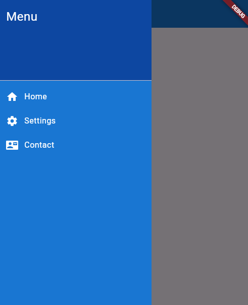
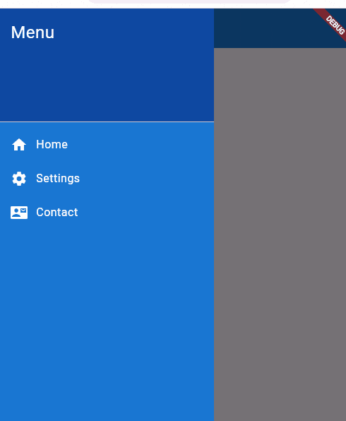
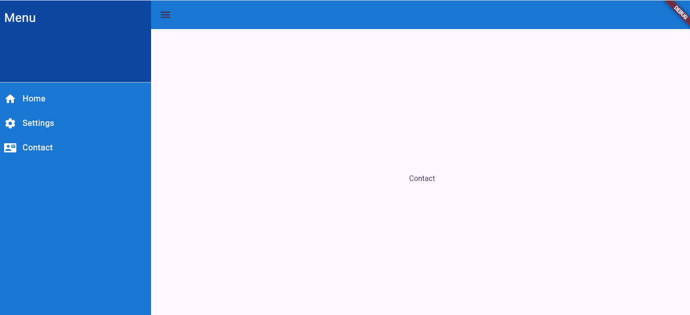

<!--
This README describes the package. If you publish this package to pub.dev,
this README's contents appear on the landing page for your package.

For information about how to write a good package README, see the guide for
[writing package pages](https://dart.dev/tools/pub/writing-package-pages).

For general information about developing packages, see the Dart guide for
[creating packages](https://dart.dev/guides/libraries/create-packages)
and the Flutter guide for
[developing packages and plugins](https://flutter.dev/to/develop-packages).
-->


# Custom Dashboard 

Custom Dashboard is an easy way to build dashboard layout for your app , but still yet very customizable . mobile , tablet and desktop view are supported.
responsive design is also supported.

## Features

- Customizable Sidebar
- Customizable Dashboard
- Responsive Design
- Toggle Sidebar action 
- Screen Switcher


## Getting Started

To use this package, add the following to yours `pubspec.yaml` file:

```yaml
dependencies:
  customdashboard: 
```

Then, import it into your Dart code:

```dart
import 'package:customdashboard/customdashboard.dart';
```

## Screenshots

Here are some screenshots of the dashboard in action:




## Demo

Check out this GIF to see the dashboard in action:




## Usage

Provide a brief example of how to use the package in a Flutter app.

```dart
// Example code here
class Dashboard extends StatelessWidget {
  const Dashboard({super.key});

  @override
  Widget build(BuildContext context) {
    return Customdashboard(
        appBar: AppBar(
          leading: IconButton(
              icon: const Icon(Icons.menu),
              onPressed: () {
                Customdashboard.toggleSidebar(
                  context,
                );
                
              }),
              
        ),
        sideBar: SideBar(),
        body: Container(),
        );
  }
}

```

## Contributing

If you would like to contribute to this package, please follow these steps:

1. Fork the repository.
2. Create a new branch for your feature or bug fix.
3. Commit your changes.
4. Push your branch and create a pull request.

## License

This project is licensed under the MIT License - see the [LICENSE](LICENSE) file for details.

